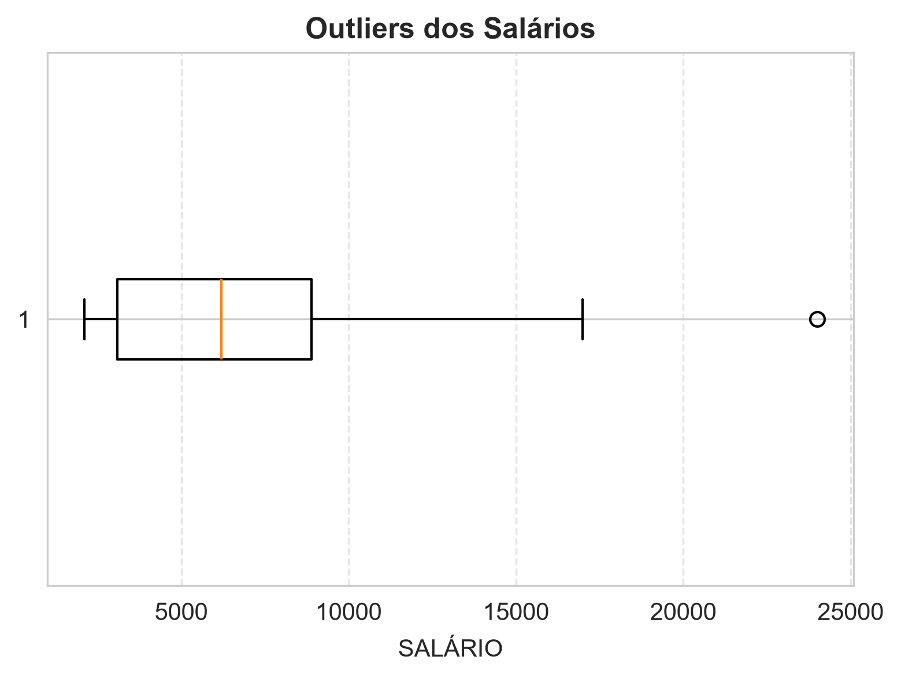
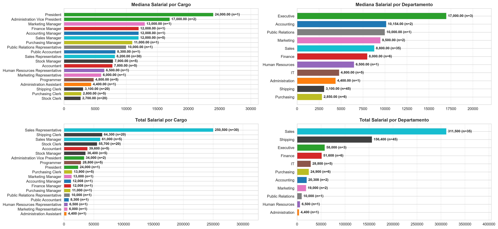
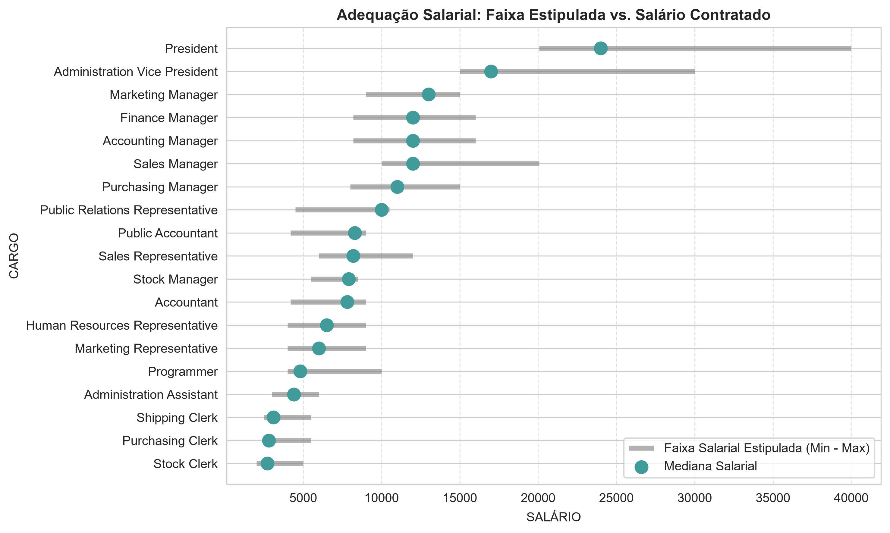
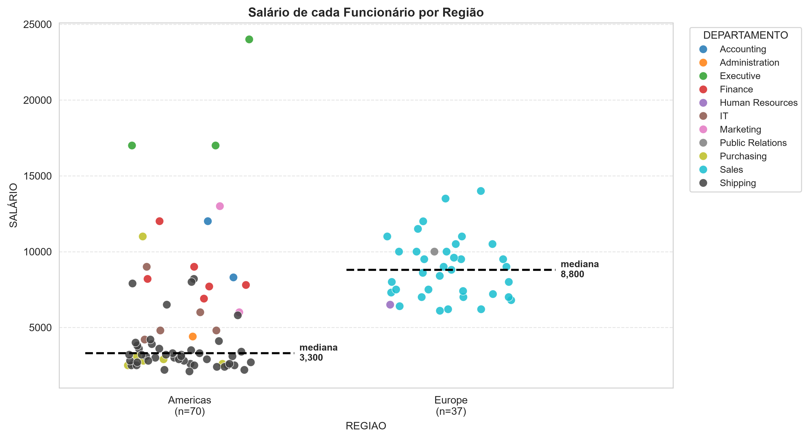
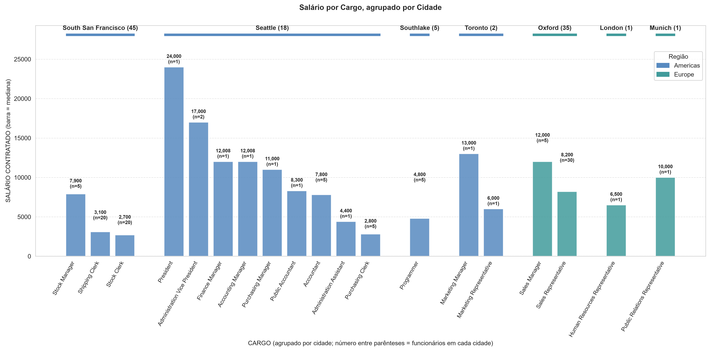

# Mini Projeto avaliativo para o curso de Visualização de dados e BI do programa SCTEC
Valéria Baggio Sjekavica - T3

---

## 1. Objetivo do trabalho
O objetivo deste projeto é fornecer uma análise à gestão de Recursos Humanos sobre a a distribuição dos salários, a relação entre cargos e departamentos e os padrões de remuneração por região.

---

## 2. Tabelas utilizadas
Foram realizadas consultas na base de datos de RH, nas colunas:
- HR.EMPLOYEES - Informação dos Funcionários
- HR.JOBS - Informação dos Cargos
- HR.DEPARTMENTS - Informação dos Departamentos
- HR.JOB_HISTORY - Informação do histórico de contratação dos Funcionários
- HR.LOCATIONS - Informação da Localização do 
- HR.COUNTRIES - Informação dos Paises que a empresa está localizada
- HR.REGIONS - Informação das Regiões onde as empresas tem filias ou funcionários trabalhando

---

## 3. Consultas ao BD
Foram realizadas duas consultas:
1ª - Informações sobre o Salário dos funcionários, o Cargo e o Departamento.
  Trouxe os seguintes dados: Nome completo do funcionário, Cargo, Departamento, Data de Contratação, Salário Contatado, Salário Mínimo e Máx, e Data de Inicio e Fim do trabalho (depois percebi que poderia não ter consultado essas duas datas, pois a informação era escassa e sem lógica nos dados. Juntei o nome e sobrenome para ficar num campo único.
2ª - Informações sobre o Funcionários e os dados de Localização onde trabalha (CEP, Endereço, Cidade, Estado, País e Região)

As colunas foram enviadas já com a tradução. Os dados das tabelas estão sem a tradução, mantendo-se no idioma inglês. Estarei atualizando em outra oportunidade, pois dá mais visibilidade e entendimento das informações.
Os dados consultados foram executados e exportados em 2 arquivos .csv para serem trabalhados em Python.

---

## 4. Análise de Estrutura Salarial e RH com Python

Este repositório contém uma Análise Exploratória de Dados (AED) sobre a estrutura salarial, o quadro de funcionários e a distribuição geográfica de uma organização, e a ralação entre eles. O projeto foi desenvolvido em Python utilizando bibliotecas para manipulação e visualização de dados, acompanhado de práticas de versionamento com Git e consultas SQL.

1. Foram carregados os arquivos .csv
2. Para cada um deles, foi realizada uma análise geral, verificando:
  - Consulta das primeiras linhas do dataframe
  - Tipos de colunas
  - Estatísticas descritivas (Cálculo de Média e Mediana)
  - Quantidade de dados nulos
  - Quantidade de valores repetidos
3. Tratamento de dados:
   - Preenchimento de dados nulos
   - Exclusão dos camops de Data de Inicio e Fim de trabalho, pois não tinha dados suficientes para serem trabalhados.
   - Conversão do campo de data para datetime
4. Unificação dos dataframes em um novo dataframe
5. Nova revisão geral dos dados
6. Tratamento de dados:
  - Com base em outras informações e com retornos únicos, completei dados faltantes
7. Cálculo de outliers do salário contratado. Só tinha um caso que era o Presidente da empresa e se entende a diferente de valores devido ao cargo.
8. Gráficos:
    1. BOXPLOT: SALÁRIOS PARA VISUALIZAR OUTLIERS
    2. PAINEL COM GRÁFICO EM BARRAS HORIZONTAL: MEDIANA E TOTAL SALARIAL POR CARGO E DEPARTAMENTO
    3. PLOTTAGEM: ADEQUAÇÃO SALARIAL: ESTIPULADO X CONTRATADO
    4. STRIP PLOT: SALÁRIO DE CADA FUNCIONÁRIO POR REGIÃO
    5. GRÁFICO DE BARRAS VERTICAL: SALÁRIO POR CARGO, AGRUPADO POR CIDADE
 
---       

## 4. Visualizações Geradas

Os gráficos gerados pelo script `analise.py` são salvos automaticamente na pasta `graficos/`:

### 1. Outliers dos Salários

ANÁLISE: 
Na comparação de todos os salários, o presidente da empresa é o único outlier. 
Devido ao cargo, faz sentido ter uma diferença com relação aos outros cargos.

### 2. Painel 2x2: Mediana e Total Salarial por Cargo e Departamento

ANÁLISE: 
Analisando os salário, as áreas executivas e de gestão possuem são os mais bem pagos. Já os que trabalham com atendimento, 
como as áreas de Expedição, Compras e Estoque, possuem os menores salários e tem a maior concentração de funcionários. 
Tendo como exceção o departamento de vendas que, tanto os gerentes como os representantes de venda, possuem salários altos e com pouca diferença entre eles. 
Por exemplo, se o comparamos com o departamento de Marketing, vemos uma diferença salarial entre os cargos:
   
Gerente de Marketing  13.000 
Repres. de Marketing   6.000
Diferença		           7.000 (mais que o dobro do salário do Representante)
   
Gerente de Vendas	    12.000
Repres. de Vendas	     8.200 
Diferença		           3.200 (bem menos que a metade do salário do Representante)
   
Sendo que no Marketing tem 2 funcionários. Ou seja, um gerente e um representante.
Se vemos o departamento de Compras, o gerente tem um salário de 4x mais que os cargos de atendente (sendo 5 funcionários a cargo).
O setor de TI conta com 5 programadores e não tem nenhum cargo de liderança atrelado. 
Segue realmente uma hierarquia horizontal ou tem uma pessoa que é procurada para responder pela área, mas não está com o cargo correspondente?

No gráfico, o departamento de VENDAS é o segundo com maior concentração de funcionários e o que tem maior custo salarial, 
pouco mais do dobro comparado ao departamento de EXPEDIÇÃO que tem mais funcionários. 
Seria interessante poder verificar se o trabalhado por esse setor está compensando para manter a quantidade de funcionários e o salário.

### 3. Adequação Salarial: Faixa Estipulada vs. Salário Contratado

ANÁLISE: 
No gráfico de adequação salarial, também podemos verificar, com análise prévia de indicadores, se os salários estão adequados. 
Alguns cargos estão perto do salário mínimo estipulado, principalmente dos funcionários com menos salário (4 dos 7 cargos). 
Outros 5 cargos estão perto ou chegando no máximo do range salarial estipulado, são eles: Contabilidade, Contabilidade Pública, Gerente de estoque, Gerente de Marketing e Relações públicas.
Os outros cargos estão na media da faixa salarial. 
Revisar se as faixas salariais estão dentro da competitividade salarial do mercado e se os salários, próximos no mínimo e no máximo da faixa, precisam de algum reajuste.

### 4. Salário de cada Funcionário por Região

ANÁLISE: 
São 70 funcionários na América e 37 na Europa.
Na Europa, encontramos 3 departamentos da empresa: Vendas, Recursos Humanos e Relações Públicas (acabou ficando escondido atrás de outro ponto e não ficou muito visível - confirmado no gráfico seguinte).
Os salários estão mais próximos, se comparado com os salários na América
Já na América, notamos maior diferencia de salários devido à concentração de ter mais departamentos e contar com mais cargos de gerentes e executivos. 
Mesmo assim, por ter mais quantidade de funcionários, a mediana do salário ficou abaixo da mediana de Europa.
Devido à concentração de cargos executivos na América, aqui parece ser a central da empresa.

### 5. Salário por Cargo, agrupado por Cidade

ANÁLISE:
O departamento executivo se localiza em Seattle junto com outros cargos gerenciais, enquanto que outros funcionários se espalham por algumas cidades. 
Mas a cidade com maior quantidade de funcionários é San Francisco na América, seguida por Oxford na Europa, onde se encontra todo o departamento de Vendas.
No dataframe não tinha informação de quantas filias tem a empresa, mas como em alguns casos poucas pessoas estão localizadas em determinada cidade, 
estou deduzindo que elas poderiam em situação de trabalho remoto. Tomando como exemplo o departamento de Marketing que é o que tem um maior valor no total de salários, 
podemos nos perguntar se eles estão em trabalho remoto e porquê todos estão localizados em Oxford. Isso está relacionado com o alto valor de salários, comparado com outros departamentos?
Mudaria considerando a contratação remota em diversas partes do mundo? Essa mudança afetaria os indicadores atuais da área? 
Essas são algumas perguntas que não encontro nesse dataframe, mas que podem ajudar o RH a analisar os dados do departamento.

---

## 5. Estrutura do Repositório

| Arquivo / Pasta | Descrição |
| :--- | :--- |
| `analise.py` | Script principal em Python contendo o tratamento dos dados, cálculos agregados e geração dos gráficos. |
| `requirements.txt` | Lista de dependências e bibliotecas Python necessárias para rodar o projeto. |
| `.gitignore` | Configuração do Git para ignorar o ambiente virtual (`.venv/`) e arquivos temporários. |
| `README.md` | Documentação completa do projeto, metodologia, resultados e guia de execução. |
| `graficos/` | Pasta contendo as imagens dos gráficos gerados em alta resolução (`.png`). |

---

## 5. Como Executar o Projeto

### 5.1. Pré-requisitos
* Python 3.10 ou superior instalado.
* Git instalado e configurado no sistema.

---

## 6. Sugestões de Melhoria e Próximos Passos

1. Tratar as colunas de datas de contratação e término de contrato para viabilizar o cálculo do tempo de empresa (*tenure*) e a separação entre funcionários ativos e inativos.
2. Incluir uma coluna explícita de `NIVEL_HIERARQUICO` ou `TIPO_CARGO` no banco de dados relacional para facilitar o agrupamento de lideranças sem depender de filtros por nome de cargo.
3. Incorporar índices de custo de vida por cidade/país e taxas de câmbio atualizadas para comparar os salários internacionais de forma ajustada ao poder de compra local e outros fatores tributários. A empresa tem funcionários em várias regiões do mundo e o RH precisa desse levantamento para tomar decisões mais adequadas a cada situação. 
Analisar se é vantajoso contratar na modalidade home office em diversas cidades, mesmo para cargos num mesmo departamento, ou se a contratação híbrida ou presencial, numa filial já existente, compensa.
4. Gerar indicadores de cada setor para calcular comprar o faturamento (individual e regional) com a folha salarial. No caso do setor de Ventas, tanto o gerente como seus liderados, tinham bons salários, comparando com outros departamentos, e também tem a diferença dos cargos de gerente e liderado, e a comparação entre mesmos tipos de cargos. Com indicadores podemos confirmar se os salários correspondentes às responsabilidades e se acompanham os retornos financeiros que a empresa estipula para cada departamento e cargo. 

